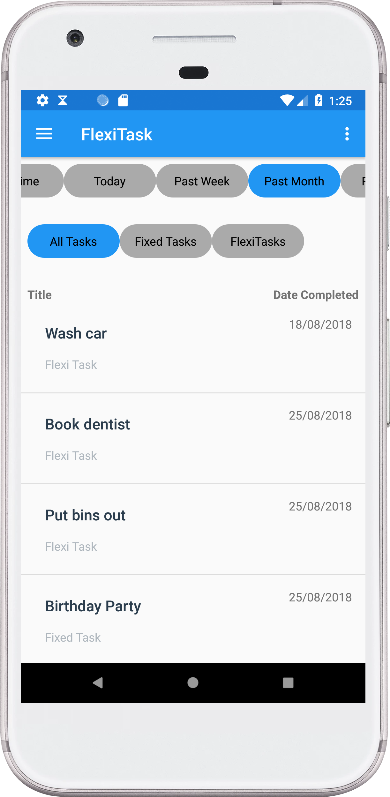

# FlexiTask 
FlexiTask is a Task managing app that facilitates both fixed and flexi tasks. A fixed task
is simply a task that has a fixed due date, that could be a Birthday on the 21st of Feb or
a bill that needs paid every 2 weeks. A flexitask on the other hand is a recurring Task which 
needs to be completed "roughly" in the time period specified. Perhaps you want to clean the windows
every fortnight, but don't mind if it's a few days late or early. The flexitask app uses a urgency 
sorting algorithm to display the tasks which are MOST overdue (relative to their recurring frequency).
For instance, a yearly task that is 4 days overdue is deemed less overdue than a weekly task which is 2 days
overdue. 

## Installation

### Requirements
* Android Studio (LATEST VERSION)
* Internet connection for first compile
* Works on API 19

### Screenshots
 

The editor and timeline view for tasks. The more overdue the task is the redder the prority colour is

The app also supports various colour blind options, changing the priority colours and app colour scheme to be more friendly for colour deficient users

The history activity lets users view their previously completed tasks

## How it works

The mainactivity (mainActivity) acts as a container to hold and switch fragments, based on what item the user has selected in its navigation draw. The Timeline Fragment Container is selected by default and contains a viewpager containing the fragments for Fixed Timeline and Flexi Timeline, this viewpager allows the user to swipe between each timeline fragment. When these fragment classes are first created (onCreate() method is called) each class initializes its own loadermanager. Once this loadermanager is up and running, it calls the OnCreateLoader() method, which initializes a new CursorLoader. This cursor loader is given a projection (a string array of the columns the activity/fragment want), the URI (like a URL but for database tables) and a sortOrder (Flexitask wants the data returned to be sorted by its priority calculation, whereas fixed task it wants the data ordered by due date). This cursorloader in turn queries the contentresolver.  
 
The contentresolver “resolves” the URI to the custom content Provider (Task Provider). This provider acts as an interface to the database, it’s here that determines whether we are inserting, updating, deleting or just querying data - and whether we want a specific row or the entire table. It performs the desired task and returns a Cursor with the data requested, back to the contentResolver, which returns back to the LoaderManager which passes it on to the cursorOnFinish() method. In this method the cursorAdapter uses the swapCursor() method and passes it this newly returned cursor to process.  
 
By using the loader thread and abstracting this data retrieval process to loaders and content providers, the app allows the user to continue using the UI with few interruptions. The app also uses a similar querying technique in the editor activities, in addition to a simple if() statement that allows us to reuse the editor activities for both creation of a new task and updating an existing task. 
 
The app checks for when the user “updates” the task from either the flexi or fixed timeline fragment in the form of the “done” button. When selecting “done” (the tick), for a fixed task, the app will check if that task is recurring or not. If it is it will update the tasks due date to (the current due date + recurring period * 86400000 (milliseconds in a day)) to get the new due date. It then restarts the cursor loader and goes and retrieve these new changes. 
 
When a flexi task is first created the date-last-completed field for that row/task is set to the current date (in milliseconds) and the next due date(in milliseconds) is derived from this by adding the recurring period * milliseconds in a day. When the user indicates they have finished an activity (by pressing the done button/ tick), the date-last-completed field is set to the current time and the next due date is recalculated. The priority rating is calculated at two stages, one in when we query the data in the Flexitask fragment loader and want the return data sorted by priority and the other in the cursoradapter where the app assigns a XML color element to indicate the priority to the user. 
 
(see algorithm bellow)

This produces a number which determine how overdue a task is. The app then organises the flexi tasks based on which tasks have the larger number, as well as assign priority colors (based on the user’s colour deficiency settings). 
 
The HistoryFragment works much the same as the flexi and fixed task timelines, in that it uses a loader manager and cursor adaptor to obtain “deleted”(deactivated) tasks. The history fragment has several buttons and corresponding listeners, that act as filters, when a button is selected it restarts loader which retrieves the appropriate data using the new parameters.  
 
When the app is started, the mainActivity creates a system alarm for a specified time (at first this is 8:00am, but can be changed in the settings). Once this alarm is triggered (eg: @8am), the Android system calls the AlarmReceiver class which cursors through upcoming active tasks, and adds their titles to an array. Once it has obtained these tasks, it utilises the Notification Helper class to create a Notification. This class first creates notification channels for Android devices running Oreo or higher to use, and creates a message with the given array of task titles from Alert Receiver. The result is returned to alert receiver and broadcasted to the users device. Alert receiver then sets up an alarm for the following day. I am currently working on a smarter implementation (App Manager) which sets the channel up the first time the app is started rather than every time the broadcast receiver calls the Notification Helper class.

## Algorithm
To determine a flexi-tasks priority the app takes todays date (in milliseconds) and subtracts 
the date the task was created/ last done (in milliseconds) - this represents the milliseconds since the task was last completed
, the app then converts this to number of days by dividing by 86,400,000 (milliseconds in a day) and adding 1 (for the due day). The app then divides that number
by how ofen the task is set to recurre (ie: weekly task, daily task). The end result is a number that represents a percentage of how
complete/overdue/underdue a task is. For tasks that have a lower recurring frequency (ie daily), each day that task is overdue will 
increase the result relativily more than a task with a higher frequnecy (ie: yearly)

     Todays Date - Date Created)/86,400,000 + 1 

     -------------------------------------------
	            Recurring Frequency
